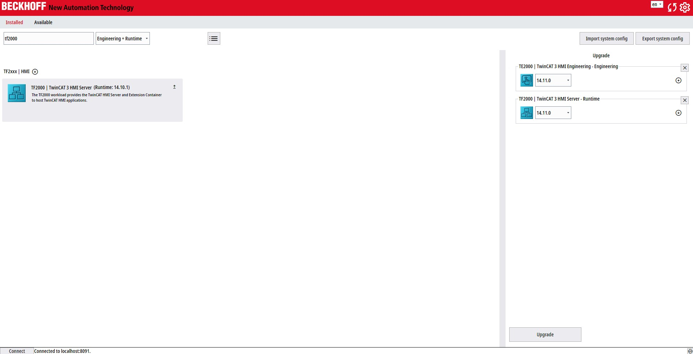
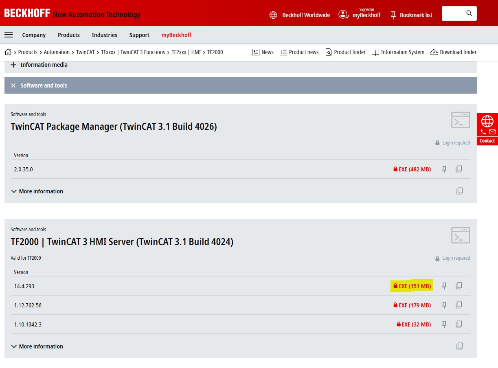
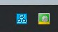
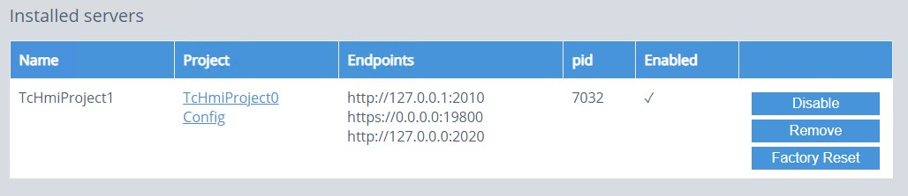

# TwinCAT HMI – Installation & Setup Guide

This README explains how to:

1. Install **TwinCAT HMI Engineering** packages on a PC for TwinCAT
2. Install the **TwinCAT HMI Server** on a PLC / IPC running Windows
3. Create a basic HMI project
4. Connect the HMI to TwinCAT / PLC using ADS

---

## 0. Prerequisites

- Beckhoff PLC / IPC running **Windows**
- Engineering PC running **Windows**
- TwinCAT 3 installed
- Administrator rights on both systems
- PLC and PC preferably on the same subnet

---

## 1. Installing HMI packages for TwinCAT

### 1.1 Install the "TE2000 - TwinCAT HMI Engineering" package

This package provides the tools needed to develop a HMI project in TwinCAT on your engineering PC.

(This should be found in the "available" tab, instead of "Upgrade" there will be "Install")

### 1.2 Install the "TF2000 - HMI Server" package

This package allows you to run a HMI server locally on your engineering PC. For testing and developing purposes.
This isn't a necessary package but it can be usefull if you dont have a Beckhoff PLC with you at all times.

(This should be found in the "available" tab, instead of "Upgrade" there will be "Install")

---

## 2. Installing TwinCAT HMI Server on the PLC (Windows)

### 2.1 Install the HMI Server package

On the **PLC / IPC**:

1. Open the link below:

   https://www.beckhoff.com/en-en/products/automation/twincat/tfxxxx-twincat-3-functions/tf2xxx-hmi/tf2000.html?

   Under "Documentation and downloads" -> "Software and tools"
   Download the .exe:

   Version 14.4.267 is used in my project.

   After downloading the file, follow this guide by Beckhoff:

   https://infosys.beckhoff.com/english.php?content=../content/1033/tf2000_tc3_hmi_server/3743410699.html&id=8865946052884691218

   When you are done you should see this blue icon in your taskbar:

   (Next to the TwinCAT icon)

---

### 2.2 Create an HMI Server instance

   When all installations are done you'll start a server instance.
   
   You can follow this guide by Beckhoff:

   https://infosys.beckhoff.com/english.php?content=../content/1033/tf2000_tc3_hmi_server/19606525707.html&id=5116914351185853268

   NOTE:

   I used more/others ports in my project:

   I did this because you can choose which ports you use for all links.

   But always check which ports Windows allows you to use freely.

   We'll come back to this.

