# TwinCAT HMI – Installation & Setup Guide

This README explains how to:

1. Install **TwinCAT HMI Engineering** packages on a PC for TwinCAT
2. Install the **TwinCAT HMI Server** on a PLC / IPC running Windows
3. Create a basic HMI project
4. Connect the HMI to TwinCAT / PLC using ADS

---

## 0. Prerequisites

- Beckhoff PLC / IPC running **Windows**
- Engineering PC running **Windows**
- TwinCAT 3 installed
- Administrator rights on both systems
- PLC and PC preferably on the same subnet

---

## 1. Installing HMI packages for TwinCAT

### 1.1 Install the "TE2000 - TwinCAT HMI Engineering" package

This package provides the tools needed to develop a HMI project in TwinCAT on your engineering PC.

(This should be found in the "available" tab, instead of "Upgrade" there will be "Install")

### 1.2 Install the "TF2000 - HMI Server" package

This package allows you to run a HMI server locally on your engineering PC. For testing and developing purposes.
This isn't a necessary package but it can be usefull if you dont have a Beckhoff PLC with you at all times.

(This should be found in the "available" tab, instead of "Upgrade" there will be "Install")

---

## 2. Installing TwinCAT HMI Server on the PLC (Windows)

### 2.1 Install the HMI Server package

On the **PLC / IPC**:

1. Open the link below:

   https://www.beckhoff.com/en-en/products/automation/twincat/tfxxxx-twincat-3-functions/tf2xxx-hmi/tf2000.html

   Under "Documentation and downloads" -> "Software and tools"
   Download the .exe:

   Version 14.4.267 is used in my project.

   After downloading the file, follow this guide by Beckhoff:

   https://infosys.beckhoff.com/english.php?content=../content/1033/tf2000_tc3_hmi_server/3743410699.html&id=8865946052884691218

   When you are done you should see this blue icon in your taskbar:

   (Next to the TwinCAT icon)

---

### 2.2 Create an HMI Server instance

   When all installations are done you'll start a server instance.
   
   You can follow this guide by Beckhoff:

   https://infosys.beckhoff.com/english.php?content=../content/1033/tf2000_tc3_hmi_server/19606525707.html&id=5116914351185853268

   NOTE:

   I used more/others ports in my project:

   I did this because you can choose which ports you use for all links.

   But always check which ports Windows allows you to use freely.

If you want to enter more ports/endpoints in the server instance open the server config:

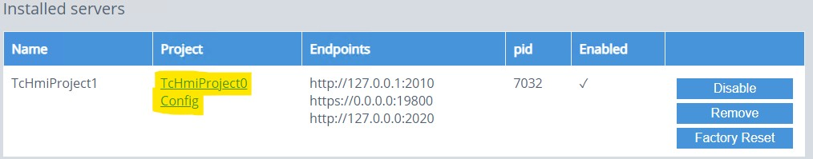

Then go to "Endpoints" in the "Webserver" in "TcHmiSrv":

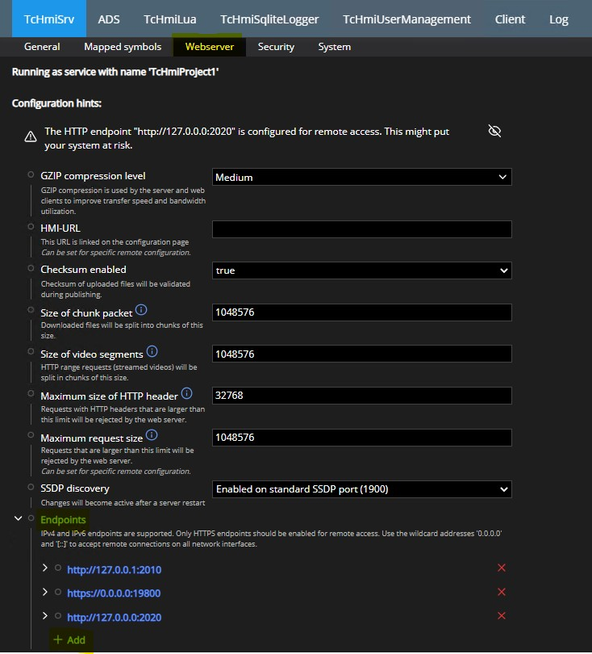

When adding ports make sure you enter the port like a link as shown below:

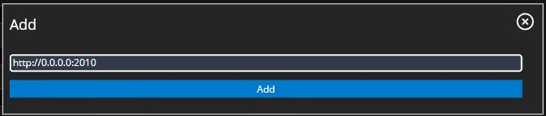

---

## 3. Setting up Windows networking rules

According to which ports you used in your server, the Windows Firewall might block network traffic for that port.

To prevent this:

Open "Windows Security"

   -> "Firewall & network protection"

   -> "Advanced settings"

   -> "Inboud rules"

Find these 4 rules:

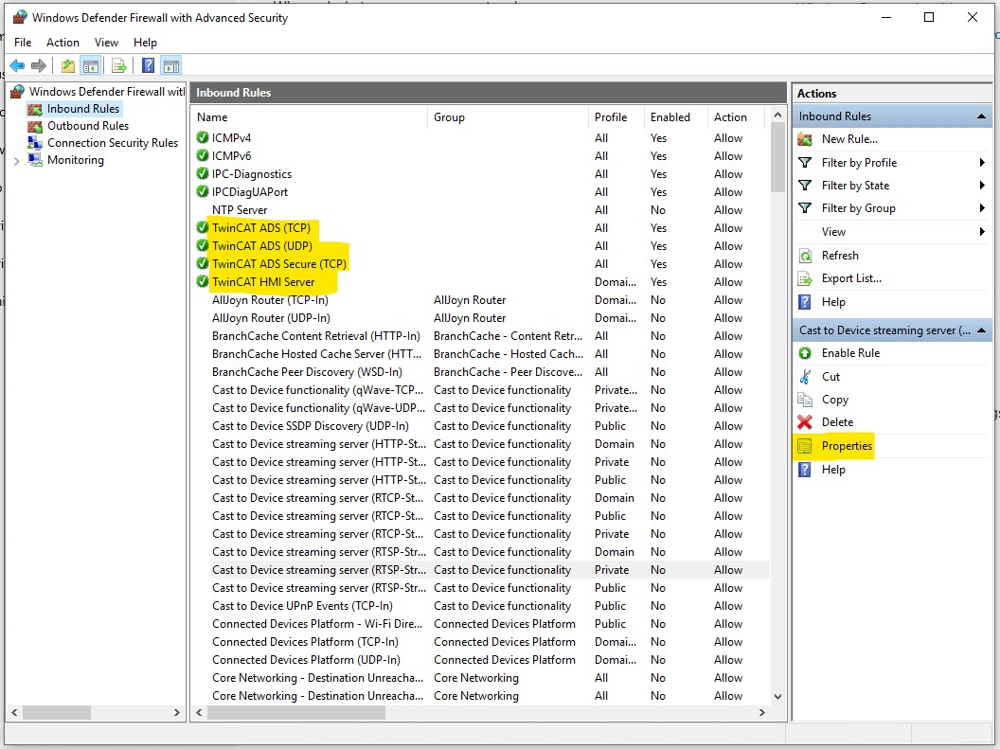

Then click the rule and click "Properties".
This window should open:

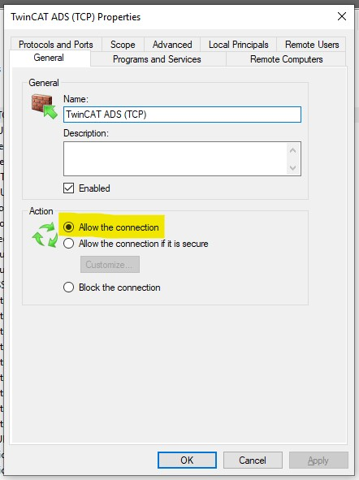

Make sure "Allow the connection" is selected for all 4 rules.

If this doesnt work or the rules aren't there, try this:

Click "New rule"

   -> Click "Port"

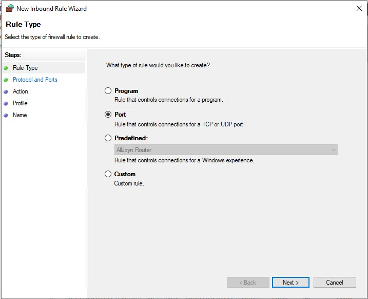

Then enter this: (Keep 48898 but change other port numbers to your numbers)

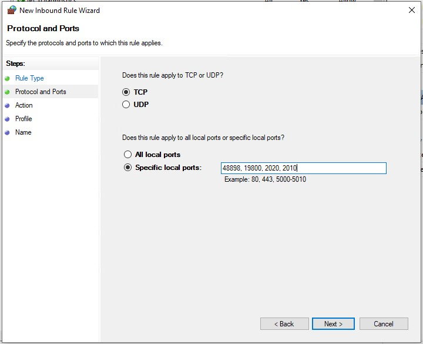

Click "Allow the connection"

Then make sure the "Public" domain is unchecked:

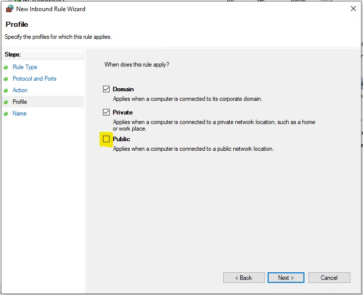

This is to stop connections if the device is in a public network.

NOTE:

Do the following step only if everything is done and you still can't connect to the HMI server.

Add the same "New rules" for those ports in the "Outbound rules"

---

## 4. Creating a TwinCAT HMI project

### 4.1 In TwinCAT create a new project

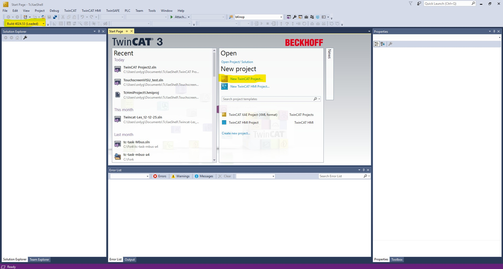

Make sure the build of your project is the same as the PLC!

Then enter a name for your project and select "TwinCAT XAE Project (XML Format)":

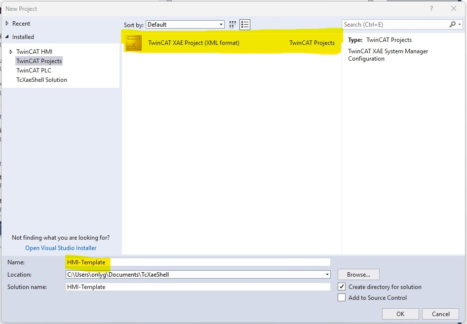

In the solution explorer right-click "PLC" -> "Add new item"

Then select "Standard PLC Project" and enter the name "PLC1"

Naming the PLC right is crucial for linking the HMI's runtime to the PLC, by default it is "PLC1".

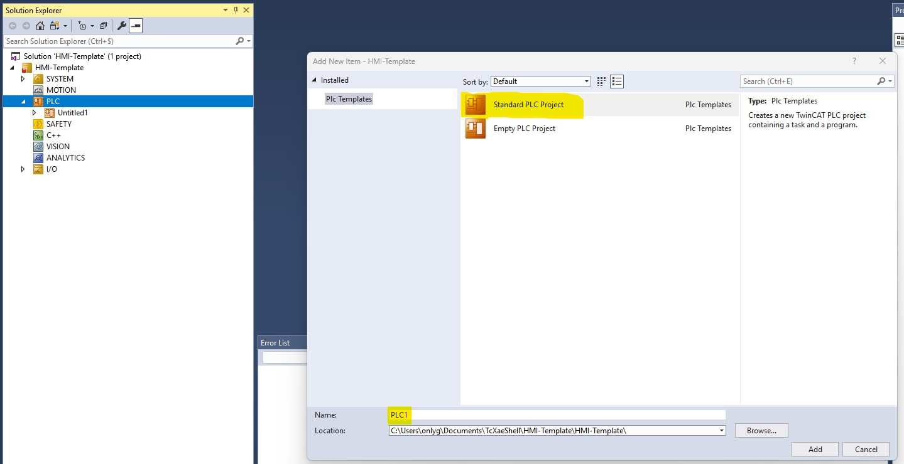

In the "MAIN(PRG)" you can write your PLC's code in Structured Text

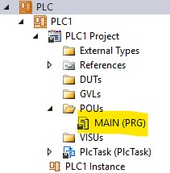

Afterwards right-click "Solution HMI-Template" and click "Build solution", do this preemptively.

### 4.2 Add HMI project

To add the HMI project to the solution do this:

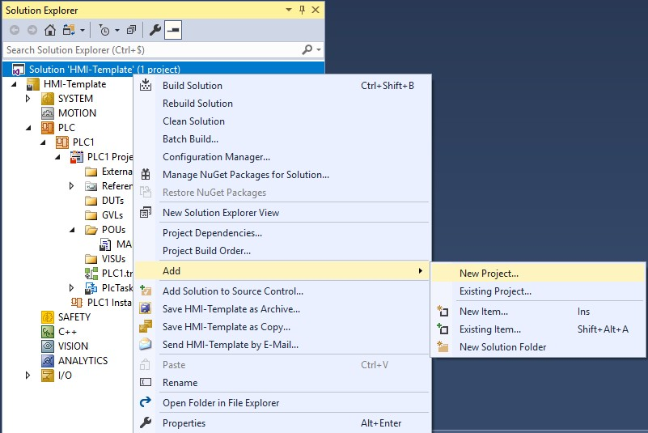

And then:

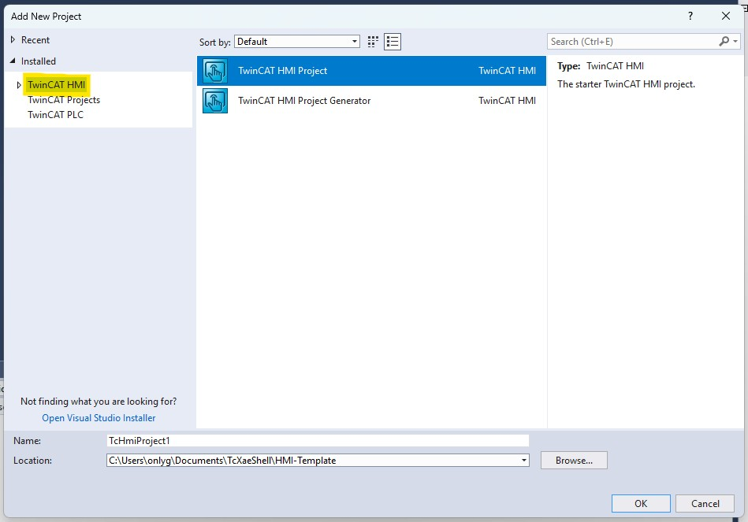

We are almost done.

To test if everything works, try publishing the HMI server to the PLC.

Right-click the HMI project, build it preemptively, then click "Publish to TwinCAT HMI Server" and enter a profile name.

Then you should see this windows:

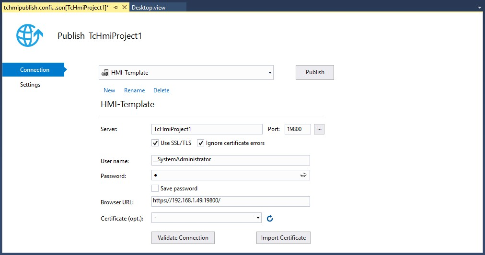

In your case most boxes will be empty, enter the info like this:

Server: The name you gave your server instance (Mine is TcHmiProject1)

Port: The HMI Service Configuration port, usually this is 19800 or 2020. If you are unsure right-click the blue icon in the taskbar -> service configuration -> look in the link in the browser which port is behind the IP.

Username: The username from the user on Windows on the PLC

Password: The PLC user password

Browser URL: This should look something like in my screenshot https://your ip address:port

TwinCAT will enter the server instance name instead of your device IP standard but change this to your IP to be certain of your connection.

After you entered all this, click "Validate"

If the image window below pops up you can publish the HMI server.

Publishing the server can take a few minutes so be patient.

If the server is published you should see this open in your browser or on the PLC's screen if it has one:

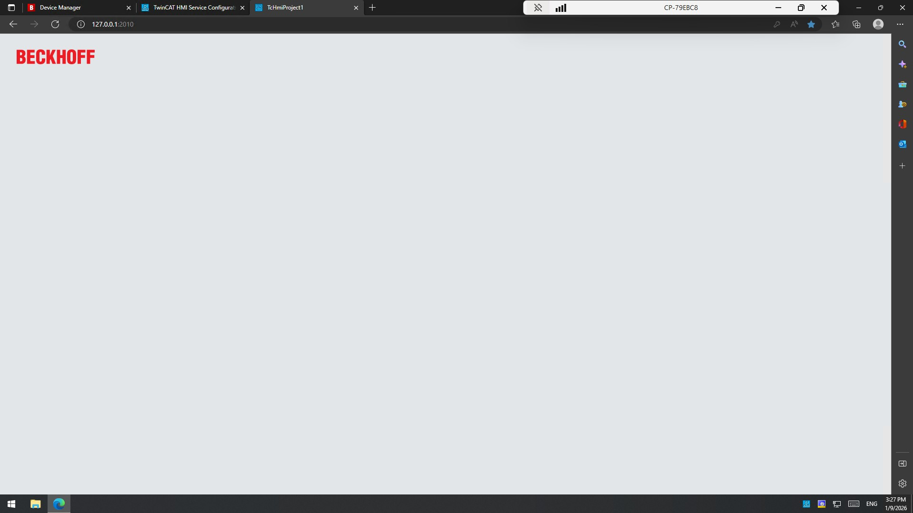

In the file "Desktop.view" you can see what will be displayed on the server's screen or browser.

You can add buttons, text, images, etc.

To add buttons you do need to add "Usercontrol" to the HMI project, by right-clicking it.

Then add the usercontrol in the desktop.view.

I havent done this yet but I will update the repo in the near future.